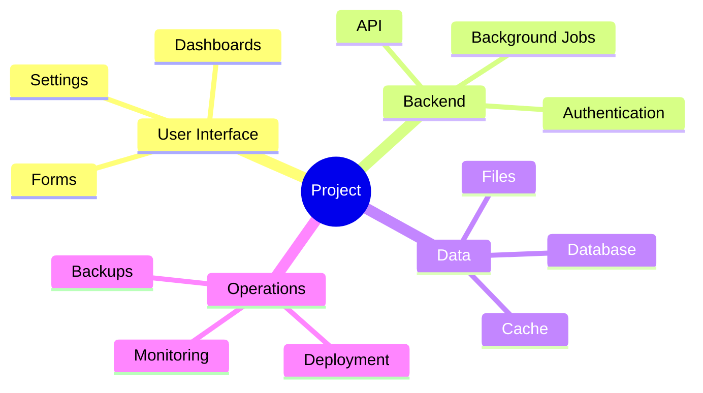
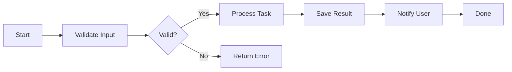

# Add Animated Diagrams, Automation Scripts, and Weekly Documentation Updates

Update the documentation builder so it also creates visual, animated, and automatically refreshed documentation.

## Animated Visual Documentation Requirements

The documentation website should include animated visual explanations wherever they improve understanding.

Add animated diagrams for:

* Data flow
* User workflows
* Task-based workflows
* Background jobs
* API request lifecycle
* Database write/read paths
* Authentication and authorization flows
* File upload and processing pipelines
* AI/model processing pipelines, if applicable
* Error handling flows
* Deployment and service startup flow
* Scheduled jobs and automation flow

Use visual formats such as:

* Animated mind maps
* Animated flow diagrams
* Step-by-step process timelines
* Interactive task progress diagrams
* Collapsible workflow trees
* Expandable architecture maps
* Clickable component diagrams
* Swimlane diagrams for user/system interactions
* Status/progress diagrams for long-running jobs

Prefer simple visual explanations over long paragraphs.

## Recommended Diagram Tools

Use the simplest tool that fits the project.

Recommended options:

* Mermaid for static Markdown diagrams
* Mermaid mind maps for Markdown-friendly mind maps
* Apache ECharts graph/tree/sankey charts for animated and interactive diagrams
* D3.js only if the project already uses it or needs custom interaction
* Plain HTML/CSS/JavaScript animations for simple flows
* SVG animations for lightweight visual explanations

Prefer Apache ECharts for animated diagrams on the documentation website.

Use Mermaid for Markdown source files because it is portable and easy to maintain.

## Mind Map Requirements

Create mind maps for major project areas.

Examples:



For the generated documentation website, convert or recreate important mind maps as animated ECharts tree or graph diagrams.

Animated mind maps should:

* Start centered on the main project concept
* Expand outward by category
* Allow users to zoom and pan
* Show tooltips on hover
* Use color-coded node types
* Support click-to-open related documentation pages
* Be mobile responsive
* Avoid excessive motion
* Respect reduced-motion preferences when possible

## Workflow Progress Diagram Requirements

For task-based workflows, create progress-style diagrams.

Examples:

* User signup process
* File upload process
* Data ingestion process
* AI analysis process
* Report generation process
* API request lifecycle
* Deployment pipeline
* Backup and restore process
* Troubleshooting workflow

Each workflow should show:

* Start condition
* Main steps
* Decision points
* Success path
* Failure path
* Retry behavior
* Output/result
* Related logs, metrics, or alerts if applicable

Use Mermaid in Markdown:



For the website, create animated versions using Apache ECharts or lightweight JavaScript.

The animation should show progress through the workflow one step at a time.

## ECharts Animated Diagram Requirements

Create reusable ECharts components for:

* Mind maps
* Data-flow diagrams
* Task-flow diagrams
* Sankey diagrams
* Dependency graphs
* Component relationship maps
* Timeline/progress diagrams

Add generated JavaScript files such as:

```text
docs/site/assets/js/diagrams.js
docs/site/assets/js/mindmaps.js
docs/site/assets/js/workflows.js
```

The diagrams should support:

* Dark and light themes
* Responsive resizing
* Tooltips
* Zoom and pan
* Clickable links to docs pages
* Optional animation
* Reduced-motion fallback
* Accessible labels where possible

Use real project structure and actual discovered workflows where possible.

If a workflow or data path is inferred, label it clearly as inferred.

If real data is unavailable, use clearly labeled sample data.

## Python Documentation Automation Scripts

Build Python scripts to help generate, validate, and update documentation automatically.

Create a documentation tooling folder:

```text
tools/docs/
  generate_docs.py
  generate_site.py
  generate_pdfs.py
  scan_project.py
  extract_api_docs.py
  extract_config_docs.py
  generate_diagrams.py
  check_links.py
  check_secrets.py
  update_changelog.py
  docs_config.yaml
```

Only create scripts that are useful for the project. If the project is small, combine related functionality into fewer scripts.

## Script Requirements

### `tools/docs/scan_project.py`

Scan the project and collect documentation metadata.

It should detect:

* Project name
* README files
* Source folders
* API routes
* CLI commands
* Config files
* Docker files
* Compose files
* Environment variable examples
* Database models
* Background jobs
* Scheduled jobs
* Frontend pages
* Tests
* Scripts
* Deployment files

Output a machine-readable summary:

```text
docs/generated/project-scan.json
```

### `tools/docs/extract_api_docs.py`

Extract API information from the project.

For FastAPI projects, prefer the OpenAPI schema.

For other frameworks, detect routes from source files where possible.

Output:

```text
docs/generated/api-reference.json
docs/developer/api-reference.md
```

API documentation should include:

* Method
* Path
* Summary
* Parameters
* Request body
* Response body
* Authentication
* Permissions
* Example curl request
* Example response
* Error examples

Use placeholders for sensitive values.

### `tools/docs/extract_config_docs.py`

Generate configuration documentation.

Detect:

* `.env.example`
* Config classes
* YAML/TOML/JSON config files
* Docker Compose environment variables
* Kubernetes manifests
* Helm values
* Systemd units
* Cron jobs

Output:

```text
docs/technical/configuration.md
docs/developer/configuration-reference.md
```

Never document real secret values.

Use placeholders such as:

```text
<API_KEY>
<ACCESS_TOKEN>
<DATABASE_URL>
<SECRET_KEY>
```

### `tools/docs/generate_diagrams.py`

Generate diagram source files and website diagram data.

It should create:

```text
docs/diagrams/
  architecture.mmd
  data-flow.mmd
  auth-flow.mmd
  task-workflows.mmd
  deployment-flow.mmd
  backup-restore-flow.mmd

docs/site/assets/data/
  mindmap.json
  workflows.json
  data-flow.json
  architecture-graph.json
```

Use Mermaid for Markdown diagrams.

Use JSON data files for ECharts-powered animated diagrams.

### `tools/docs/generate_docs.py`

Main documentation generation script.

It should:

* Run the project scan
* Extract API docs
* Extract configuration docs
* Generate diagrams
* Generate or update Markdown pages
* Build the documentation index
* Update glossary
* Update changelog
* Run link checks
* Run secret checks
* Print a clean summary of generated files

Suggested command:

```bash
python tools/docs/generate_docs.py
```

Optional flags:

```bash
python tools/docs/generate_docs.py --full
python tools/docs/generate_docs.py --api-only
python tools/docs/generate_docs.py --diagrams-only
python tools/docs/generate_docs.py --skip-pdf
python tools/docs/generate_docs.py --check-only
```

### `tools/docs/generate_site.py`

Generate the static documentation website.

It should:

* Convert Markdown to HTML
* Build navigation
* Build search index
* Add dark/light theme support
* Add diagram pages
* Include animated ECharts diagrams
* Include expandable API examples
* Include copy buttons
* Include warning and security callouts
* Include PDF download links

Output:

```text
docs/site/
```

### `tools/docs/generate_pdfs.py`

Generate PDF versions of each documentation track.

Output:

```text
docs/pdf/public-documentation.pdf
docs/pdf/technical-documentation.pdf
docs/pdf/developer-documentation.pdf
docs/pdf/user-training-documentation.pdf
```

Use the simplest reliable available option:

* Playwright
* WeasyPrint
* Pandoc
* Puppeteer
* Markdown PDF tooling

If the tool is not installed, the script should print clear installation instructions.

### `tools/docs/check_links.py`

Check internal and external documentation links.

It should detect:

* Broken Markdown links
* Missing local files
* Broken anchors
* Broken image links
* Broken site links

### `tools/docs/check_secrets.py`

Scan documentation before publishing.

It should detect likely:

* API keys
* Tokens
* Passwords
* Private keys
* JWTs
* Database connection strings
* Cloud credentials
* Internal-only values
* `.env` secrets

If secrets are found, fail the documentation build and print the file and line number.

Use allowlists for safe placeholders such as:

```text
<API_KEY>
<ACCESS_TOKEN>
<SECRET_KEY>
example_token
your-password-here
```

### `tools/docs/update_changelog.py`

Update documentation changelog from project changes.

It should track:

* New docs pages
* Updated API endpoints
* Added config values
* Updated diagrams
* Removed or deprecated pages
* Documentation generation date

Output:

```text
docs/changelog.md
```

## Documentation Configuration File

Create:

```text
tools/docs/docs_config.yaml
```

It should allow customization without editing scripts.

Example:

```yaml
project:
  name: "Project Name"
  description: "Short project description"
  base_url: "http://localhost:8000"

docs:
  source_dir: "docs"
  output_dir: "docs/site"
  pdf_dir: "docs/pdf"
  generated_dir: "docs/generated"

audiences:
  public: true
  technical: true
  developer: true
  training: true

theme:
  default: "dark"
  allow_light_mode: true
  glassmorphism: true
  accent_color: "blue"

diagrams:
  mermaid: true
  echarts: true
  animated: true
  reduced_motion_fallback: true

automation:
  weekly_update: true
  schedule: "Friday 23:00"
  run_pdf_generation: true
  run_secret_scan: true
  run_link_check: true
```

## Weekly Documentation Update Automation

Add automation so documentation can be regenerated weekly on Friday night.

Support both cron and systemd timer where possible.

Prefer systemd timers on Linux servers because they are easier to inspect and log.

Create:

```text
deploy/docs-cron.example
deploy/docs-update.service
deploy/docs-update.timer
```

## Cron Example

Create:

```text
deploy/docs-cron.example
```

Example:

```cron
# Regenerate project documentation every Friday night at 11:00 PM.
# Update PROJECT_DIR before installing.
0 23 * * 5 cd /opt/your-project && /usr/bin/python3 tools/docs/generate_docs.py --full >> logs/docs-update.log 2>&1
```

Also create an install helper if appropriate:

```text
scripts/install-docs-cron.sh
```

The script should:

* Detect the project directory
* Create a `logs/` folder if missing
* Add the cron job safely
* Avoid duplicate cron entries
* Print the installed cron schedule
* Explain how to remove it

## Systemd Timer Example

Create:

```text
deploy/docs-update.service
```

```ini
[Unit]
Description=Regenerate project documentation

[Service]
Type=oneshot
WorkingDirectory=/opt/your-project
ExecStart=/usr/bin/python3 tools/docs/generate_docs.py --full
StandardOutput=append:/opt/your-project/logs/docs-update.log
StandardError=append:/opt/your-project/logs/docs-update.log
```

Create:

```text
deploy/docs-update.timer
```

```ini
[Unit]
Description=Run documentation update every Friday night

[Timer]
OnCalendar=Fri 23:00
Persistent=true
Unit=docs-update.service

[Install]
WantedBy=timers.target
```

Create:

```text
scripts/install-docs-systemd-timer.sh
```

The script should:

* Detect the project directory
* Copy or generate the service and timer files
* Replace `/opt/your-project` with the actual project path
* Create a `logs/` folder
* Run `systemctl daemon-reload`
* Enable and start the timer
* Show timer status
* Print commands to check logs

Also include removal instructions:

```bash
sudo systemctl disable --now docs-update.timer
sudo rm -f /etc/systemd/system/docs-update.service
sudo rm -f /etc/systemd/system/docs-update.timer
sudo systemctl daemon-reload
```

## Documentation Automation Safety

Weekly automation must be safe.

Requirements:

* Do not overwrite manually written documentation without preserving custom sections.
* Use generated markers for generated sections:

```markdown
<!-- DOCS-GENERATED:START -->
Generated content here.
<!-- DOCS-GENERATED:END -->
```

* Only replace content inside generated markers.
* Preserve manually written content outside generated markers.
* Commit-friendly output with stable formatting.
* Fail if secrets are detected.
* Fail if critical links are broken.
* Write logs to:

```text
logs/docs-update.log
```

* Generate a summary report:

```text
docs/generated/docs-update-report.md
```

The report should include:

* Date/time
* Files created
* Files updated
* Files skipped
* API endpoints found
* Diagrams generated
* PDFs generated
* Link check results
* Secret scan results
* Warnings
* Errors
* Recommended follow-up actions

## Weekly Update Git Behavior

If the project uses Git, the documentation update script should detect it.

Do not automatically commit changes unless explicitly configured.

In `docs_config.yaml`, support:

```yaml
git:
  enabled: true
  auto_commit: false
  auto_commit_message: "docs: weekly documentation refresh"
```

If `auto_commit` is false, print the changed files and suggested commands:

```bash
git status
git diff -- docs tools/docs deploy scripts
git add docs tools/docs deploy scripts
git commit -m "docs: update generated documentation"
```

If `auto_commit` is true:

* Run secret scan before committing
* Run link check before committing
* Commit only documentation-related files
* Never push automatically unless explicitly configured
* Do not commit `.env`, logs, private config, or secret files

## Weekly Update Notification

If the project already has a notification system, optionally add support for notification after weekly doc updates.

Examples:

* Email
* Slack
* Discord
* Google Chat
* Webhook

Notification should include:

* Success or failure
* Files updated
* Warnings
* Errors
* Link check status
* Secret scan status
* PDF generation status

Do not add notification dependencies unless the project already supports them or configuration is provided.

## Documentation Freshness Badges

Add freshness metadata to documentation pages.

Each page should show:

* Last generated date
* Source files used, where useful
* Version or Git commit hash, if available
* Whether content is generated, manually written, or mixed

Example:

```markdown
> Last updated: 2026-06-28  
> Source: generated from project scan  
> Status: mixed generated/manual content
```

## Final Completion Summary

After implementation, provide a concise summary with:

1. Documentation folders created or updated.
2. Python scripts created.
3. Animated diagrams added.
4. Cron/systemd automation files created.
5. How to manually regenerate documentation.
6. How to install the weekly Friday night update job.
7. How to disable the weekly update job.
8. Any assumptions made.
9. Any areas that need manual review.
